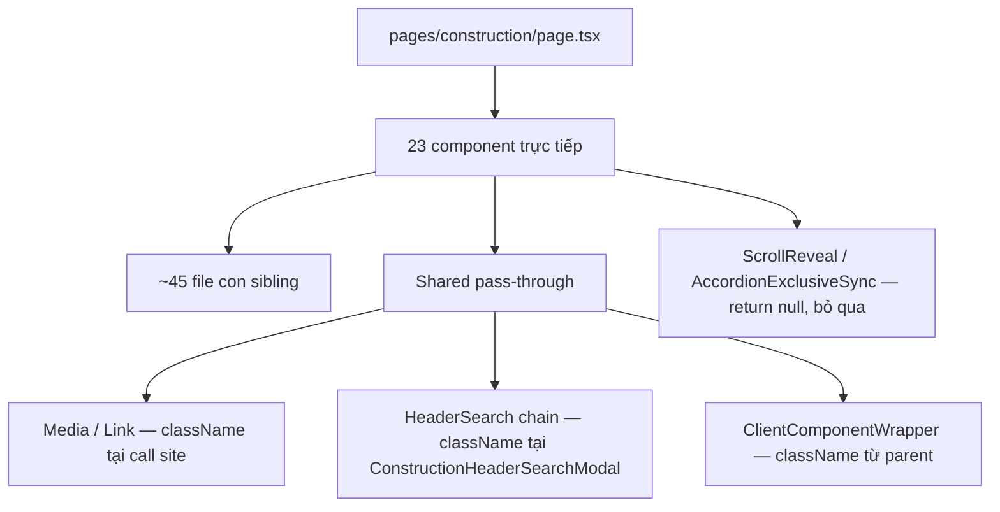

# Chuyển toàn bộ Tailwind sang `!important` cho trang Construction

## Bối cảnh

Trang [`pages/construction/page.tsx`](pages/construction/page.tsx) render **23 component top-level**, mở rộng thành **~68 file `.tsx`** trong cây phụ thuộc. Một số component đã dùng prefix `!` một phần (theo convention trong [`.cursor/skills/react-components/SKILL.md`](.cursor/skills/react-components/SKILL.md) — chống override Porto/Bootstrap), nhưng **13 nhóm vẫn chưa có `!`**, và **5 nhóm mixed** cần hoàn thiện.

Lý do cần `!`: [`src/styles.css`](src/styles.css) (dòng 454–485) ghi rõ Porto/Bootstrap redefine `.py-4`, `.gap-4`, `.p-3`, `ul { padding-left }` với `!important`, khiến layout header và nhiều utility bị lệch khi embed vào WordPress.



## Quy tắc chuyển đổi

Áp dụng cho **mọi utility Tailwind** trong chuỗi `className` (user chọn "construction only" — không sửa file shared toàn cục):

| Loại | Ví dụ | Xử lý |
|------|-------|-------|
| Utility chưa có `!` | `flex`, `md:grid`, `hover:opacity-100` | Thêm `!` sau variant: `!flex`, `md:!grid`, `hover:!opacity-100` |
| Đã có `!` | `!flex`, `md:!text-xl` | Giữ nguyên, không double-prefix |
| Semantic hook | `about-intro`, `construction-header-bar` | **Không** thêm `!` |
| Named group/peer | `group/featured`, `peer/menu`, `peer/sub` | **Không** thêm `!` |
| Arbitrary selector trong class | `[&_path]:[vector-effect:non-scaling-stroke]` | Thêm `!` trước utility: `[&_path]:![vector-effect:non-scaling-stroke]` |
| Pass-through props | `className` từ model/props | Prefix `!` trước khi merge vào `cn()` |

**Pattern tham chiếu** (đã đúng convention):

```38:42:src/components/development-partners/DevelopmentPartners.tsx
  const slideInBase = cn(
    "!opacity-0 !translate-y-10 transition-[opacity,translate] duration-[1.2s] ease-out",
    "group-data-[in-view=true]/partners:!opacity-100 group-data-[in-view=true]/partners:!translate-y-0",
    "motion-reduce:!opacity-100 motion-reduce:!translate-y-0 motion-reduce:transition-none",
  );
```

## Phạm vi file

### Nhóm cần chuyển đổi hoàn toàn (`none` — 13 component, ~35 file)

- [`src/components/page-background/`](src/components/page-background/)
- [`src/components/construction-header/`](src/components/construction-header/) — 6 file
- [`src/components/video-hero-banner/`](src/components/video-hero-banner/) — 2 file
- [`src/components/about-intro/`](src/components/about-intro/) — 1 file chính (ScrollReveal bỏ qua)
- [`src/components/director-intro/`](src/components/director-intro/) — 1 file chính
- [`src/components/director-profile/`](src/components/director-profile/) — 2 file (ScrollReveal bỏ qua)
- [`src/components/vision-mission/`](src/components/vision-mission/) — 2 file
- [`src/components/fields-of-activity/`](src/components/fields-of-activity/) — 3 file
- [`src/components/construction-highlights/`](src/components/construction-highlights/) — 2 file
- [`src/components/news-events/`](src/components/news-events/) — 2 file
- [`src/components/contact-cta/`](src/components/contact-cta/) — 1 file
- [`src/components/floating-contact/`](src/components/floating-contact/) — 3 file
- [`src/components/construction-footer/`](src/components/construction-footer/) — 6 file

### Nhóm cần hoàn thiện (`mixed`/`heavy` — 10 component)

Rà soát từng chuỗi className, bổ sung `!` cho utility còn thiếu:

- [`collaboration-intro/`](src/components/collaboration-intro/) — nhiều `!` nhưng còn class thường ở layout wrapper
- [`service-offerings/`](src/components/service-offerings/)
- [`outstanding-advantages/`](src/components/outstanding-advantages/)
- [`development-partners/`](src/components/development-partners/)
- [`youtube-video-list/`](src/components/youtube-video-list/)
- [`key-personnel/`](src/components/key-personnel/)
- [`featured-projects/`](src/components/featured-projects/)
- [`project-category-gallery/`](src/components/project-category-gallery/)
- [`job-listing-list/`](src/components/job-listing-list/)
- [`contact-popup/`](src/components/contact-popup/)

### Shared subcomponents — chỉ sửa tại call site (construction only)

Không sửa [`Media.tsx`](src/components/media/Media.tsx), [`Link.tsx`](src/components/link/Link.tsx), [`HeaderSearch.tsx`](src/components/header/HeaderSearch.tsx), [`AutocompleteSearch.tsx`](src/components/header/AutocompleteSearch.tsx), [`AutocompleteItems.tsx`](src/components/header/AutocompleteItems.tsx):

- Mọi `<Media className="…" />`, `<Link className="…" />` trong cây construction → prefix `!` trên utilities
- [`ConstructionHeaderSearchModal.tsx`](src/components/construction-header/ConstructionHeaderSearchModal.tsx): truyền `className` có `!` xuống `<HeaderSearch className="…" />` và các wrapper modal/search input

### Bỏ qua (không có styling)

- 15 file `*ScrollReveal.tsx` — `return null`
- [`AccordionExclusiveSync.tsx`](src/components/accordion-exclusive-sync/AccordionExclusiveSync.tsx) — `return null`
- [`ClientComponentWrapper.tsx`](src/components/ClientComponentWrapper.tsx) — chỉ pass-through; parent chịu trách nhiệm prefix `!`

### Không sửa

- [`pages/construction/page.tsx`](pages/construction/page.tsx) — wrapper `<div>` không có utility
- [`src/data/*`](src/data/) — không chứa `className` cho construction
- [`html/`](html/), [`src/generated/`](src/generated/) — build output
- [`src/styles.css`](src/styles.css) — giữ nguyên lần này; sau khi migration xong có thể rà soát dư thừa rule Porto override cho header (optional follow-up)

## Thứ tự thực hiện (theo batch để review dễ)

1. **Shell trang**: PageBackground, ConstructionHeader (+ modals/menu), ConstructionFooter, FloatingContact, ContactCta, ContactPopup
2. **Hero & intro blocks**: VideoHeroBanner, AboutIntro, DirectorIntro, DirectorProfile, VisionMission
3. **Content sections**: KeyPersonnel, DevelopmentPartners, CollaborationIntro, ServiceOfferings, OutstandingAdvantages, YoutubeVideoList, FieldsOfActivity, ConstructionHighlights
4. **Gallery & listings**: FeaturedProjects, ProjectCategoryGallery, NewsEvents, JobListingList
5. **Rà soát mixed**: quét `rg` trong 23 thư mục component tìm utility không có `!` (regex heuristic)

## Kiểm tra sau khi hoàn thành

```bash
bun run typecheck
bun run build:html
npx playwright test tests/construction-header.spec.ts
```

- Mở preview `http://localhost:5173/pages/construction/` — so layout header, accordion, carousel, gallery, pagination
- Xác nhận không có class bị double-prefix (`!!flex`)

## Rủi ro & lưu ý

- **Diff lớn** (~60 file source) — làm theo batch, không thay đổi logic/component structure
- **Variant syntax**: sai `!md:flex` → đúng `md:!flex`; cần cẩn thận với `group-hover:`, `peer-checked/`, `data-[…]:`
- **Shared HeaderSearch chain**: vì không sửa file shared, mọi utility search modal phải được prefix tại [`ConstructionHeaderSearchModal.tsx`](src/components/construction-header/ConstructionHeaderSearchModal.tsx) qua prop `className`; nếu AutocompleteSearch hard-code class nội bộ, cần bọc thêm wrapper có `!` hoặc chấp nhận phần input search không được bảo vệ (kiểm tra khi implement)
