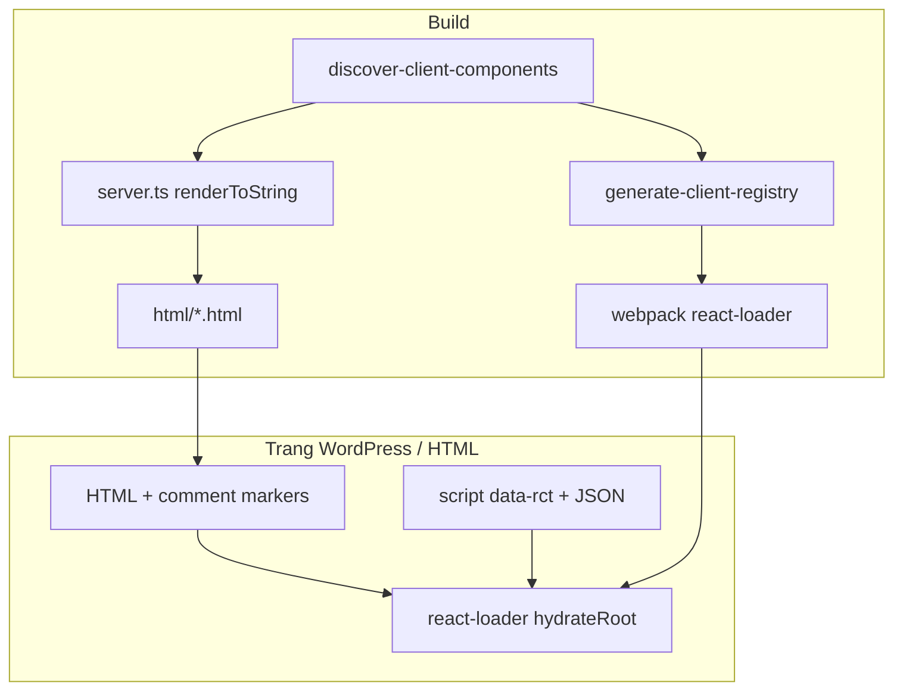

# api-rc — Hướng dẫn tạo component

Dự án render React thành HTML tĩnh (SSR) và hydrate phía browser cho các component có `"use client"`. Tài liệu này mô tả quy ước đặt tên và các bước khi thêm component mới.

## Tổng quan luồng



| Loại | Directive | SSR (`server.ts`) | Hydrate (browser) |
|------|-----------|-------------------|-------------------|
| Server component | Không có `"use client"` | Khai báo tay trong `STATIC_COMPONENT_MAP` (vd. `Header`, `App`) | Không |
| Client component | `"use client"` dòng đầu | Tự phát hiện + file data | Tự đăng ký qua `src/generated/client-registry.ts` |

---

## Quy ước đặt tên

Giả sử component file là `MyFeature.tsx` (PascalCase):

| Mục | Quy ước | Ví dụ |
|-----|---------|--------|
| File component | `src/components/<folder>/MyFeature.tsx` | `src/components/carousel/Carousel.tsx` |
| File data | `src/data/my-feature.ts` (kebab-case) | `src/data/autocomplete-search.ts` |
| Export data | `myFeature` (camelCase) **hoặc** `export default` | `autocompleteSearch`, `carousel` (default) |
| Key hydrate (`data-rct`) | Cùng camelCase export | `autocompleteSearch`, `carousel` |
| File HTML output | `html/MyFeature.html` | `html/Carousel.html` |

Công thức:

- `MyFeature` → data file: `my-feature.ts`
- `MyFeature` → export / `data-rct`: `myFeature`

---

## 1. Client component (có tương tác, hooks)

Dùng khi cần `useState`, `useEffect`, event handler, v.v.

### Bước 1 — Tạo component

```tsx
"use client";

export interface MyFeatureModel {
  title: string;
}

const MyFeature = (model: MyFeatureModel) => {
  const { title } = model;
  return <div>{title}</div>;
};

export default MyFeature;
```

- `"use client"` phải nằm trong **5 dòng đầu** file.
- `export default` component.
- Không đặt file trong `src/components/ui/` (thư mục này bị bỏ qua khi quét).

### Bước 2 — Tạo data

`src/data/my-feature.ts`:

```ts
import type { MyFeatureModel } from "@/components/my-folder/MyFeature";

const myFeature: MyFeatureModel = {
  title: "Hello",
};

export { myFeature };
// hoặc: export default myFeature;
```

Nếu dùng `export default`, build vẫn nhận data (ưu tiên named export, fallback `default`).

### Bước 3 — Gắn vào layout server component

Trong component cha (không có `"use client"`), bọc bằng `ClientComponentWrapper` và thêm `ReactSection` với **cùng key** `data-rct`:

```tsx
import MyFeature from "./my-folder/MyFeature";
import ClientComponentWrapper from "../ClientComponentWrapper";
import ReactSection from "../ReactSection";
import type { MyFeatureModel } from "./my-folder/MyFeature";

// trong JSX:
<ClientComponentWrapper>
  <MyFeature {...myFeatureData} />
  <ReactSection type="myFeature" data={myFeatureData} />
</ClientComponentWrapper>
```

- `type` của `ReactSection` = camelCase tên component (`myFeature`).
- `data` = object props truyền vào component (JSON trong `<script data-rct>`).

### Bước 4 — Build

```bash
bun run build:html
```

Script sẽ:

1. Quét `"use client"` → sinh `src/generated/client-registry.ts`
2. Render `html/MyFeature.html` (và các client component khác)
3. Giữ `html/Header.html`, `html/App.html` từ map tĩnh

Không cần sửa `server.ts` hay `client-components.tsx` cho client component mới.

### Kiểm tra nhanh

```bash
bun run typecheck
bun run build:browser
```

---

## 2. Server component (HTML tĩnh, không hydrate)

Dùng cho layout, markup không cần JavaScript phía client.

### Bước 1 — Component (không có `"use client"`)

```tsx
export interface SectionModel {
  heading: string;
}

const Section = (model: SectionModel) => {
  return <section><h2>{model.heading}</h2></section>;
};

export default Section;
```

### Bước 2 — Data

`src/data/section.ts` với export `section` hoặc `export default`.

### Bước 3 — Đăng ký SSR (nếu cần file HTML riêng)

Thêm vào `STATIC_COMPONENT_MAP` trong [`server.ts`](server.ts):

```ts
import Section from "@/components/section/Section";
import { section } from "@/data/section";

const STATIC_COMPONENT_MAP = {
  // ...
  Section: {
    component: Section,
    model: section,
    needFormat: true, // true = format HTML bằng Prettier
  },
};
```

Chạy `bun run build:html` → `html/Section.html`.

---

## 3. Trang tổng hợp (`App`, `Header`)

- [`src/components/App.tsx`](src/components/App.tsx): ghép nhiều section, bọc client components.
- [`server.ts`](server.ts): `App` và `Header` nằm trong `STATIC_COMPONENT_MAP`.
- Data: [`src/data/header.ts`](src/data/header.ts), v.v.

Client component lồng trong `App`/`Header` vẫn cần `ClientComponentWrapper` + `ReactSection` như mục 1.

---

## Cấu trúc thư mục gợi ý

```
src/
  components/
    my-feature/
      MyFeature.tsx      # "use client" nếu cần hydrate
    header/
      Header.tsx         # server component
    ui/                  # primitives — không auto-discover
    ClientComponentWrapper.tsx
    ReactSection.tsx
    client-components.tsx  # re-export registry generated
  data/
    my-feature.ts
  generated/
    client-registry.ts   # auto-generated — không sửa tay
  lib/
    discover-client-components.ts
html/
  MyFeature.html
  App.html
scripts/
  generate-client-registry.ts
server.ts
```

---

## Scripts thường dùng

| Lệnh | Mô tả |
|------|--------|
| `bun run dev` | Sinh registry + Vite + Webpack watch |
| `bun run build:html` | Sinh registry + SSR → `html/` |
| `bun run build:browser` | Bundle `react-loader` + client chunks |
| `bun run typecheck` | Kiểm tra TypeScript |

---

## Ví dụ có sẵn trong repo

| Component | Client? | Data | `data-rct` |
|-----------|---------|------|------------|
| [`AutocompleteSearch`](src/components/header/AutocompleteSearch.tsx) | Có | [`autocomplete-search.ts`](src/data/autocomplete-search.ts) | `autocompleteSearch` |
| [`Carousel`](src/components/carousel/Carousel.tsx) | Có | [`carousel.ts`](src/data/carousel.ts) | `carousel` |
| [`Header`](src/components/header/Header.tsx) | Không | [`header.ts`](src/data/header.ts) | — |
| [`App`](src/components/App.tsx) | Không | — | — |

Tham khảo cách gắn client component: [`HeaderTop.tsx`](src/components/header/HeaderTop.tsx).

---

## Lỗi thường gặp

**Component không xuất hiện trong `html/` sau `build:html`**

- Thiếu `"use client"` hoặc directive không khớp regex (phải đúng `"use client"` / `'use client'`).
- Thiếu file data đúng tên kebab-case.
- File nằm trong `src/components/ui/`.

**Hydrate không chạy trên trang**

- `ReactSection` `type` khác key trong registry (phải camelCase, vd. `myFeature`).
- Chưa chạy `build:html` / `dev` (registry chưa cập nhật).
- Thiếu `ClientComponentWrapper` (comment markers cho pipeline HTML).

**TypeScript báo lỗi import generated**

- Chạy `bun run scripts/generate-client-registry.ts` trước `typecheck` lần đầu clone repo.

---

## Ghi chú kỹ thuật

- SSR client component chỉ render HTML tĩnh; hooks chạy khi `react-loader` gọi `hydrateRoot`.
- `src/generated/client-registry.ts` do [`scripts/generate-client-registry.ts`](scripts/generate-client-registry.ts) sinh ra — chỉnh sửa tay sẽ bị ghi đè.
- Override quy ước (tùy chọn, chưa bật): có thể thêm `src/client-component.overrides.json` theo plan nếu cần data file tên khác.
